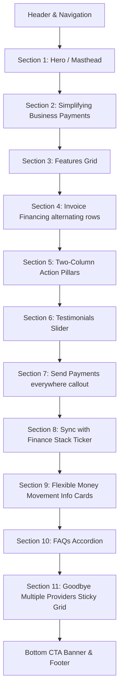

# Aria Landing Page - Master Layout & Content Blueprint

This document provides a comprehensive blueprint of the landing page, compiling the visual structure, layout configurations, styling parameters, and complete textual data section-by-section.

---

## 🎨 Global Design Tokens & Styling Blueprint
* **Primary Accent Color**: `#FF7A00` (Primary Orange) — used for linear gradients, button sweep hover backdrops, visual borders, and primary checkmark arrows.
* **Secondary / Hover Tones**: `#E66E00` (`var(--color-emerald)`) — slightly darker orange used for link/icon hover colors and lists indicators.
* **Main Text Color**: `#111827` (`var(--color-night)`) — deep charcoal/black ensuring high readability.
* **Primary Backdrop**: `#FFFFFF` (`var(--color-white)`) — pure white container background.
* **Secondary Card Tones**:
  * Soft Cream: `#FFF6E9` (`var(--color-grey-5)`) — FAQ backgrounds, dropdown backgrounds, card layouts.
  * Modern Gray: `#6B7280` (`var(--color-grey-30)`) — secondary text, inactive indicators, borders.
  * Dark Charcoal: `#1F2937` (`var(--color-forest)`) — footer background, ticker track background, hero overlay components.
* **Typography**:
  * Heading Font: `'F37Lineca', sans-serif`
  * Body Font: `'STKBureau-Sans', sans-serif`

---

## 🗺️ Master Section-by-Section Mapping



---

### 0. Header & Navigation

#### Layout & Spacing
* **Component Type**: Fixed top site header (`<header class="site-header">`).
* **Design Structure**: Flexible container with `justify-content: space-between; align-items: center;`. Features glassmorphic backdrop filters (`backdrop-filter: blur(12px)`) and a thin bottom border (`border-bottom: 1px solid var(--color-forest-15)`).
* **Heights**: 80px (Desktop), 64px (Mobile).

#### Visual & Textual Content
* **Logo link**: Left-aligned clickable SVG logo inheriting active text color (redirects to `index.html`).
* **Navigation Menu**: Centered navigation menu list (`desktop-nav` hidden on mobile):
  * "Product" (Button trigger)
  * "Solutions" (Button trigger)
  * "Clients" (Anchor pointing to `customers/index.html`)
  * "Developers" (Button trigger)
  * "Resources" (Button trigger)
* **Actions Block**: Right-aligned items container:
  * **Language Selector**: Clickable flag icon (displays flag-en/flag-fr) with dropdown selection.
  * **CTA Button**: "Get a demo" (styled with `.btn-secondary`, redirects to `demo/index.html`).
  * **Mobile Hamburger trigger**: Active state toggles three horizontal lines `.hamburger-line` into an "X" shape.

---

### 1. Section 1: Hero / Masthead

#### Layout & Spacing
* **Component Type**: Standard layout section (`<section class="hero-section">`).
* **Design Structure**: CSS Grid (`hero-grid`) with 2 columns on desktop (1 column on mobile) containing content blocks on the left, and absolute positioned graphic layers on the right.
* **Spacing**: `padding-top: 140px; padding-bottom: 120px;`.

#### Visual & Textual Content
* **Left Content Block**:
  * **Subheading**: "Payments Infrastructure" (`.text-subheading` in Modern Gray, uppercase).
  * **Main Title (H1)**: "Your B2B payments toolkit" (H1, heavy font `'F37Lineca'`).
  * **Intro Paragraph**: "You have complex payment flows. Aria gets it. Keep your supply chain, control how money moves, and track every single payment — in one place."
  * **Action Button**: "Speak to sales" (styled with `.btn-primary` and liquid slide-sweep hover animation).
* **Right Visual Block**:
  * **Hero Backdrop Wrapper**: Multilayered overlapping SVG polygons rotated and positioned absolutely to build a glowing backdrop, using a sunset cybersecurity gradient: Primary Orange (`#FF7A00`) ➔ Amber (`#F59E0B`) ➔ Coral (`#EF4444`).

---

### 2. Section 2: Simplifying Business Payments

#### Layout & Spacing
* **Component Type**: Plain white background layout (`<section class="bg-white">`).
* **Design Structure**: Two-column responsive grid (`two-col-grid`) that splits into a 50/50 layout on desktops and wraps vertically on mobile viewports.

#### Visual & Textual Content
* **Left Column (Text & Benefits)**:
  * **Heading (H2)**: "Simplifying business payments"
  * **Body Copy**: "We get it. Payments between businesses are complex, involving purchase orders, invoices, credit memos and much, much more. Not to mention the need for someone to process everything manually. Aria’s APIs automate everything — taking care of all payment flows."
  * **Bullet Checklist**: Check items styled with `.check-item` flex layouts containing custom arrow icons fill-mapped to `var(--color-emerald)`:
    * "Trigger payments anytime, right after receiving invoices"
    * "Define payment terms"
    * "Redirect payments anywhere"
* **Right Column (Mockup Container)**:
  * **Visual Placeholder**: Solid dark charcoal container (`.two-col-visual-block bg-forest`) with aspect-ratio `628 / 502` to host product interface mockups.

---

### 3. Section 3: Features Grid

#### Layout & Spacing
* **Component Type**: Soft cream background layout (`<section class="bg-grey-5">`).
* **Design Structure**: Section header (`section-intro`) with grid containing 3 cards side-by-side on desktop, stacking to single column on mobile.

#### Visual & Textual Content
* **Intro Header**:
  * **Subheading**: "Features"
  * **Heading (H2)**: "Powerful payment processing"
* **Grid Card 1 (Automated APIs)**:
  * **Header Visual**: Warm peach-cream background holding a physical illustration (`assets/images/Transfers.jpg`).
  * **Title**: "Automated APIs"
  * **Body Description**: "Reduce operating costs and minimize errors from manual processes with our suite of APIs. With Aria, 99% of payments are automated."
* **Grid Card 2 (Modular configuration)**:
  * **Header Visual**: Soft gray visual block placeholder.
  * **Title**: "Modular configuration"
  * **Body Description**: "Enjoy configurable and flexible payment workflows that fit your business and supply chain, from triggers to terms and redirects."
* **Grid Card 3 (Flexible payments)**:
  * **Header Visual**: Brand orange visual block placeholder.
  * **Title**: "Flexible payments"
  * **Body Description**: "Send money here, there and everywhere with multi-currency and multi-payment methods, including SEPA, SCT, SWIFT or FPS."

---

### 4. Section 4: Invoice Financing & Dashboard (Two-Row Split)

#### Layout & Spacing
* **Component Type**: Plain white background layout (`<section class="bg-white">`).
* **Design Structure**: Centered section header, followed by two stacked `two-col-grid` rows. Row 1 features a reverse flex/grid layout (`reverse`) to alternate mockup and content positions for aesthetic layout rhythm.

#### Visual & Textual Content
* **Section Intro Header**:
  * **Heading (H2)**: "Get growing with seamless pay-outs & pay-ins"
* **Row 1 (Accept payments)**:
  * **Left Column (Visual Block)**: Solid light gray placeholder block.
  * **Right Column (Content Block)**:
    * **Heading (H2)**: "Accept more invoice payments"
    * **Paragraph**: "Orchestrate invoice payments in multiple countries and currencies with wire transfers that make transactions on your platform seamless. Then grow transaction volume and unlock revenue sharing opportunities."
    * **Arrow link**: "See supported currencies" (styled with `.arrow-link` and circular hover ring, points to `invoice-financing/index.html`).
* **Row 2 (Empower teams)**:
  * **Left Column (Content Block)**:
    * **Heading (H2)**: "Empower your finance teams"
    * **Paragraph**: "Monitor the whole lifecycle of a transaction and its invoices. Trigger pay-outs, monitor pay-ins, reconcile everything and redirect money — from one dashboard."
    * **Arrow link**: "Learn more" (points to `invoice-financing/index.html`).
  * **Right Column (Visual Block)**: Midnight black/charcoal placeholder block containing dashboard illustration (`assets/images/Monitor-Paymentsmidnight.jpg`).

---

### 5. Section 5: Two-Column Action Pillars

#### Layout & Spacing
* **Component Type**: Plain white background layout (`<section class="bg-white">`).
* **Design Structure**: Flex/Grid columns separating two main product pillars.

#### Visual & Textual Content
* **Pillar 1 (Simplify experiences)**:
  * **Graphic**: Custom vector icon (`assets/images/Frame-1000003113ICONS.svg`).
  * **Title (H3)**: "Simplify payment experiences"
  * **Description**: "Improve payment experiences for your customers by providing a single IBAN to buyers and automating redirections."
* **Pillar 2 (Extended terms)**:
  * **Graphic**: Custom vector icon (`assets/images/Frame-1948759152ICONS.svg`).
  * **Title (H3)**: "Offer extended terms & instant payouts"
  * **Description**: "Provide the option of extended payment terms to buyers or instant pay-ins for suppliers — it’s completely up to you."
  * **Link**: "Explore Invoice Financing" (redirects to `invoice-financing/index.html`).

---

### 6. Section 6: Client Stories Slider (Testimonials)

#### Layout & Spacing
* **Component Type**: Plain white background layout (`<section class="bg-white">`).
* **Design Structure**: Horizontal slider container (`slider-container`) powered by JavaScript. Calculates viewport space and card widths to slide dynamically on resize and click.
* **Controls**: Bottom-right slider navigation buttons (`prev` and `next`) carrying SVG icons. Previous button begins disabled.

#### Visual & Textual Content
* **Testimonial Slide 1 (Malt)**:
  * **Card Styling**: Deep warm brown (`bg-plum`) background with cream text.
  * **Quote**: “Aria is a true growth partner: not only are they fully committed to evolving with us, but they also deliver real efficiency when it comes to implementing their solutions.”
  * **Author details**: Katharina Schneider, VP Finance & Strategy
  * **Logo & Link**: Malt Unbound logo (`assets/images/malt-unbound.svg`) and "Read full story" arrow link.
* **Testimonial Slide 2 (StaffMe)**:
  * **Card Styling**: Soft warm peach-cream background (`bg-sky`) with charcoal text.
  * **Title (H3)**: "StaffMe increases its NPS by 0.8 with Aria"
  * **Logo & Link**: StaffMe Powered by NOWJOBS logo (`assets/images/StaffMe-Powered-by-NOWJOBS-Forest.svg`) and "Read full story" arrow link.
* **Testimonial Slide 3 (Comet)**:
  * **Card Styling**: Charcoal background (`bg-forest`) with white text.
  * **Quote**: “Aria is a 2.0, if not 3.0 solution, and it's entirely evident. It aligns with Comet's DNA, which is also a company of this new generation.”
  * **Author details**: Antoine Bordalis, CFO at Comet
  * **Logo & Link**: Comet White logo (`assets/images/Comet-White.svg`) and "Learn more" link.
* **Testimonial Slide 4 (Jump)**:
  * **Card Styling**: Light peach background (`bg-salmon`) with brown text contrast.
  * **Title (H3)**: "Jump turns invoices into wages in less than 24 hours with Aria"
  * **Logo & Link**: JUMP Brick logo (`assets/images/JUMP_Brick.svg`) and "Read full story" link.

---

### 7. Section 7: Send Payments Everywhere (Callout Banner)

#### Layout & Spacing
* **Component Type**: Outer white background section wrapping a rounded container.
* **Design Structure**: Rounded-card box styled with `position: relative; overflow: hidden; border-radius: 12px;` and background set to charcoal (`bg-forest`).

#### Visual & Textual Content
* **Backdrop Video**: Background video elements (`currencies.webm` / `currencies-1.mov`) layered underneath text contents with opacity configurations. Plays automatically, looped and muted.
* **Text Overlays**:
  * **Title (H2)**: "Send payments everywhere"
  * **Description**: "Process payments between buyers and suppliers in over 100 countries and multiple currencies including EUR, USD and GBP."
  * **Link**: "See supported countries" (links to `https://docs.helloaria.eu/page/supported-countries`).

---

### 8. Section 8: Sync with Finance Stack (Ticker)

#### Layout & Spacing
* **Component Type**: White background section wrapping centered info and a logo marquee.
* **Design Structure**: Continuous looping marquee layout (`ticker-container`). The inner track (`ticker-track`) translates along the X-axis indefinitely using CSS animations:
  ```css
  @keyframes ticker-scroll {
      0% { transform: translate3d(0, 0, 0); }
      100% { transform: translate3d(-50%, 0, 0); }
  }
  ```

#### Visual & Textual Content
* **Marquee Items**: Four integration logotypes duplicated inside the HTML track structure to create a seamless infinite loop:
  * Sage Integration (`Frame-1000003126.svg`)
  * Pennylane Integration (`Frame-1000003125.svg`)
  * Quickbooks Integration (`Frame-1000003127.svg`)
  * Xero Integration (`Frame-1000003129.svg`)
* **Text Content**:
  * **Title (H2)**: "Sync with your finance stack"
  * **Description**: "Ditch the data entry. Aria auto-syncs with your ERP and bookkeeping software, balancing your books in a flash."

---

### 9. Section 9: Flexible Money Movement (Value Columns)

#### Layout & Spacing
* **Component Type**: Plain white background layout (`<section class="bg-white">`).
* **Design Structure**: Two-column layout grid. The left column spans the heading, while the right column lists three vertical cards. A full-width graphic sits at the bottom of the section.

#### Visual & Textual Content
* **Left Column**:
  * **Heading (H2)**: "The most flexible way to move money"
* **Right Column Cards Stack**:
  * **Card 1 (We speak software)**:
    * **Icon**: `assets/images/Products.svg`
    * **Title (H3)**: "We speak software"
    * **Description**: "Our white-labeled B2B payment API seamlessly integrates with any industry or software. It’s agnostic, customizable, and lets you create a payment experience that perfectly fits your brand."
  * **Card 2 (No juggling)**:
    * **Icon**: `assets/images/Products-1.svg`
    * **Title (H3)**: "No more juggling multiple tools"
    * **Description**: "Manage payments, invoice financing, and risk management all in one place. No more spinning plates — focus on what matters most: your business."
  * **Card 3 (Always-on support)**:
    * **Icon**: `assets/images/Products-2.svg`
    * **Title (H3)**: "Always-on support"
    * **Description**: "We’re flexible, adaptable, and with you every step of the way. We don’t just implement, we become your partner in innovation, constantly improving to keep your payments (and business) growing."
* **Section Bottom Banner**:
  * **Image**: Static payment infrastructure graphic (`assets/images/api-new-static.jpg`).

---

### 10. Section 10: FAQs Accordion

#### Layout & Spacing
* **Component Type**: Soft cream background layout (`<section class="bg-grey-5">`).
* **Design Structure**: Two-column grid layout dividing the section title/docs link on the left, and a stack of three vertical accordions on the right.
* **Transitions**: Expandable panels animate height smoothly using CSS Grid transitions on row parameters (`grid-template-rows: 0fr ➔ 1fr`).

#### Visual & Textual Content
* **Left Column**:
  * **Heading (H2)**: "We’re here to help"
  * **Link**: "Learn more" (points to docs getting-started page)
* **Right Column FAQ items**:
  * **Item 1**:
    * **Question**: "What countries does Aria cover for buyers and suppliers?"
    * **Answer**: "With Aria, you can process payments between buyers and suppliers in over 100 countries. Head to our docs to see which countries and currencies we cover."
  * **Item 2**:
    * **Question**: "How fast do my suppliers get paid?"
    * **Answer**: "From instant to 24 hours in most cases."
  * **Item 3**:
    * **Question**: "Do you have a minimum fee or minimum volumes?"
    * **Answer**: "Minimum 200k€ but for hyper-growth companies, we can always adapt."

---

### 11. Section 11: Goodbye Multiple Providers (Sticky Grid)

#### Layout & Spacing
* **Component Type**: Plain white background layout (`<section class="bg-white">`).
* **Design Structure**: Centered section intro heading followed by a split layout grid (`grid-sticky-layout`). On desktop viewports, the left column remains fixed/sticky (`position: sticky; top: 120px;`) while the right column scrolls.

#### Visual & Textual Content
* **Left Sticky Column**:
  * **Content Block**:
    * **Label**: "Invoice Financing"
    * **Title (H3)**: "Embed invoice financing & payment terms into your product with one API"
    * **Link**: "Learn more" (points to `invoice-financing/index.html`)
  * **Sticky visual block**: A solid mockup visual box designed for animations.
* **Right Scrolling Column**:
  * **Card 1 (Protection)**:
    * **Link/Title**: "Protection" (points to `protection/index.html`)
    * **Description**: "Enjoy 100% protection against payment defaults — we take on all credit and dispute risk."
    * **Visual**: Illustration image (`assets/images/Protection-1.jpg`) inside dark card block.
  * **Card 2 (Risk Scoring)**:
    * **Link/Title**: "Risk Scoring" (points to `risk-scoring/index.html`)
    * **Description**: "Make the right decisions with simple yet powerful insights on fraud and payment risk."
    * **Visual**: Illustration image (`assets/images/Risk-Scoring-1.jpg`) inside dark card block.

---

### 12. Bottom CTA Block & Footer

#### Layout & Spacing
* **Component Type**: Outer footer container enclosing a rounded CTA card and standard link columns (`bottom-cta-outer`).
* **Design Structure**:
  * **CTA Banner**: Styled with rounded borders and a charcoal background.
  * **Footer Navigation**: 5-column CSS Grid column layouts mapping corporate categories.

#### Visual & Textual Content
* **CTA Banner**:
  * **Title (H2)**: "Click. Pay. Done."
  * **Description**: "Getting started with Aria is easy — just like our payments."
  * **CTA Button**: "Speak to sales" (links to `contact-us/index.html`)
* **Footer Navigation Links**:
  * **Products**: Payments, Invoice Financing, Protection, Risk Scoring, How It Works
  * **Solutions**: Marketplaces, SaaS, Enterprises
  * **Developers**: Guides, API Reference, Changelog
  * **Resources**: Customers, Resources, Blog, Press
  * **Company**: About, Careers, Contact
* **Footer Brand Row**:
  * **Logo**: Aria SVG logo.
  * **Social links**: LinkedIn (`linkedin.com/company/helloaria`) and YouTube (`youtube.com/@hello-aria`) buttons.
  * **Legal**: Privacy Policy, Cookie Policy, Terms of use.
  * **Copyright info**: "Copyright © Aria 2026."
